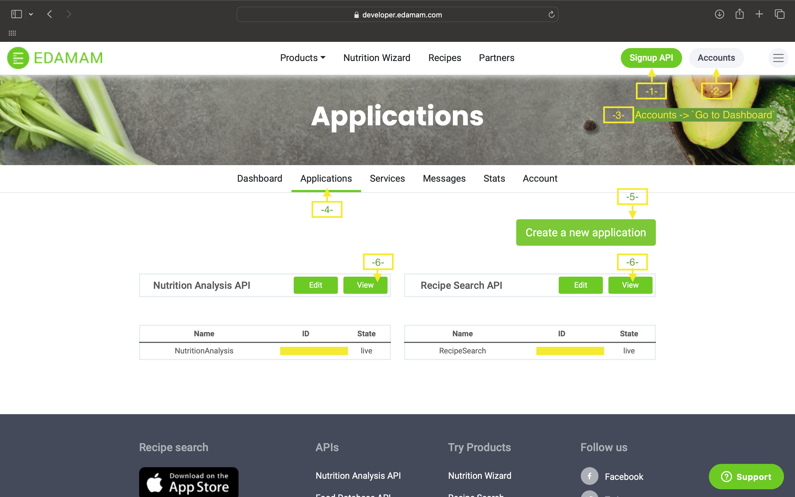
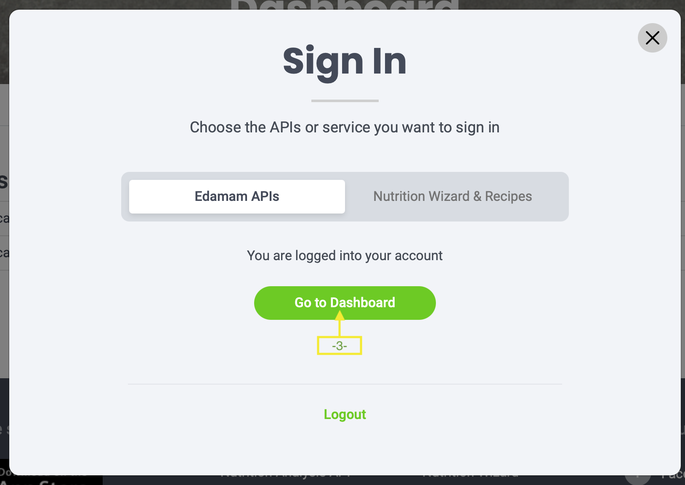

# RecipeSearch
CFG Python & Apps course project | worked with @Ayjahm & Stephanie 

**Oct 2022:** Project submission to CFG

**Sep 2023:** Code update after Edamam API `Recipe Search V2` release

To run the project on your device:
1) Clone the repo on your device
2) Make sure you've Python & VSCode or PyCharm installed on your device
3) Open the project root in VSCode/PyCharm, switch to virtual env, and ensure your `pip` is working, if not run `python3 -m ensurepip` in VSCode/PyCharm's terminal
4) Next, install requests by running the following: `python -m pip install requests` in VSCode/PyCharm's terminal
5) Visit [Edamam API website](https://www.edamam.com), click button `Signup API`, and create an account, open [Applications Tab](https://developer.edamam.com//admin/applications/), create 2 new applications - one for `Nutrition Analysis API`, one for `Recipe Search API` press `View` next to each one to check your credentials for each API, and place this data within `AppConfig.py` file

6) Visit [RapidApi website](https://rapidapi.com/hub), create an account, visit [Spoonacular API tab](https://rapidapi.com/spoonacular/api/recipe-food-nutrition), subscribe to this API to obtain `key` and `host`, and place this data within `AppConfig.py` file
7) Run in the VSCode/PyCharm's terminal: `python EdamamAPI_recipeSearch.py` or `python SpoonacularAPI_recipeSearch.py` to run the chosen file
8) Happy coding! 

